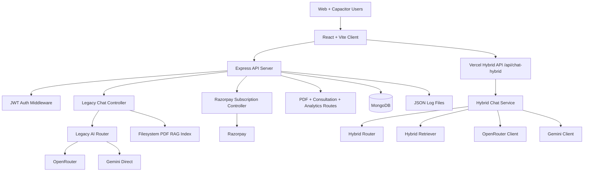
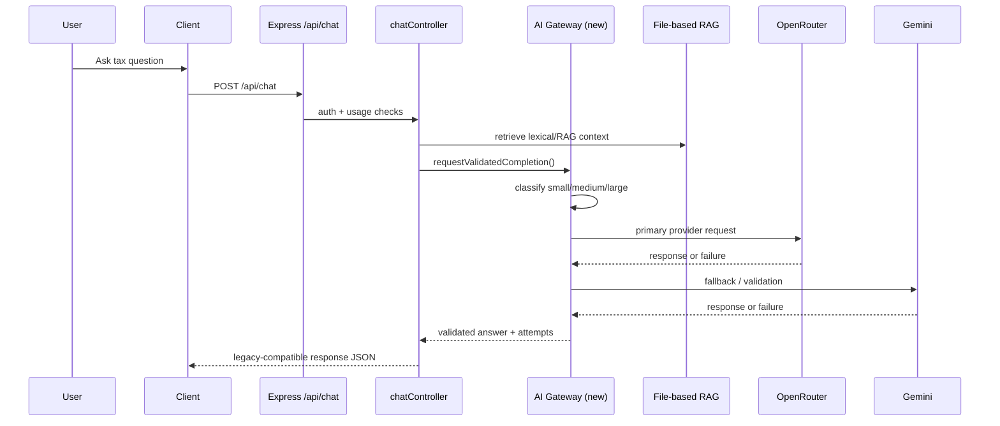
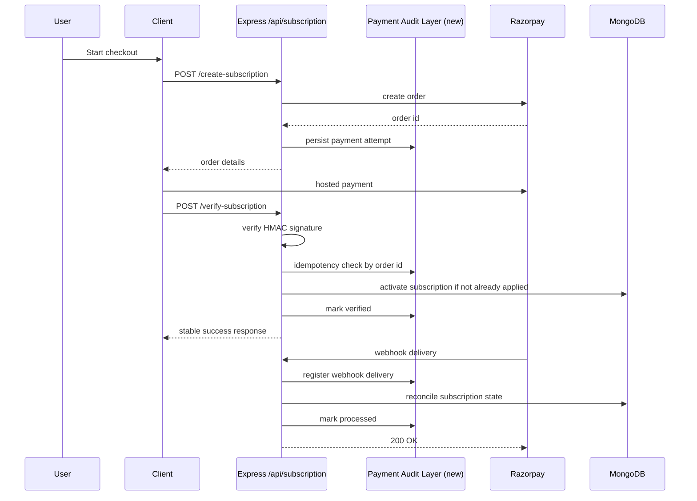

# nritax.ai Architecture Audit and Productionization Plan

## Executive Summary

The current production repository is **not** a Supabase/serverless platform today. As of **May 14, 2026**, the active codebase is a **Vite/React client**, a **single Express/MongoDB backend**, and a partially separate **hybrid AI path** used by Vercel API handlers. That mismatch is the first architecture risk: planning against the wrong target would create unnecessary rewrites and break live flows.

The safest path is an **incremental strangler pattern**:

1. Keep the current Express and client APIs stable.
2. Introduce a centralized AI gateway behind existing server contracts.
3. Add durable payment idempotency and webhook audit trails beside current logic.
4. Move expensive/slow work to async workers behind feature flags.
5. Only then split services and infrastructure.

## Current Architecture



## AI Request Lifecycle



## Payment Lifecycle



## Scalability Bottlenecks

| Area | Current State | Impact | Priority |
| --- | --- | --- | --- |
| AI execution | Synchronous provider calls on request path | Latency spikes, provider stalls block users | P0 |
| RAG storage | Filesystem PDF parsing/indexing | Slow cold starts, weak recall, hard to scale horizontally | P0 |
| Payments | No durable webhook dedupe or full audit ledger | Duplicate processing and weak reconciliation | P0 |
| Backend topology | Single Express process does everything | CPU contention, no async isolation | P0 |
| Observability | JSON files + console logs | Poor production debugging, no SLOs | P1 |
| Database | MongoDB only, no read/write separation | Limits analytical and enterprise workloads | P1 |
| Frontend | Heavy UI dependency graph | Slower initial load and mobile pressure | P1 |
| Deployment | Mixed Vercel/Express patterns | Split control plane and unclear ownership | P1 |

## Security Review

### Strengths

- JWT auth is present on protected routes.
- Razorpay webhook signatures are validated.
- CORS allow-list is enforced.
- Global rate limiting exists.

### Gaps

- Payment events were not previously durably recorded for audit/replay safety.
- AI and analytics logs are stored in local JSON files, which is weak for PII handling and multi-instance deployment.
- Mongo connection is established per process with no pooled gateway/proxy strategy.
- No explicit secret rotation workflow exists in repo.
- No evidence of field-level encryption or PII minimization for tax/payment records.
- No OpenTelemetry, centralized tracing, or Sentry integration is wired in yet.

## Technical Debt Report

### P0 debt

- Two AI systems coexist (`server/services/*` and `server/hybrid/*`) with duplicated provider logic.
- Request/response logging is filesystem-based and not instance-safe.
- Payment success depends on synchronous route logic with limited replay protection.
- RAG is tightly coupled to controller logic.

### P1 debt

- Client dependency surface is broad: MUI, Radix, charting, PDF libs, motion, DnD, and Capacitor all ship from one app.
- Hybrid TypeScript services are not yet the single source of truth for AI.
- Analytics storage in JSON files blocks serious reporting and alerting.

### P2 debt

- Naming and package metadata still contain scaffold leftovers.
- Repo contains temp mirrors outside the main app folder, which increases operator error risk.

## Cost Analysis

### Current cost drivers

- Premium model calls are still reachable on the hot path.
- Gemini fallback may duplicate spend on failed/slow requests.
- File-based RAG retrieval gives lower precision, causing longer prompts and more tokens.
- Synchronous server routes keep expensive work on always-on application nodes.

### Target cost mix

- 70% small model or small-model-equivalent routed tasks
- 20% RAG + small/medium model
- 10% premium reasoning path

### Expected savings

- AI gateway routing and validation should reduce unnecessary large-model usage by **25-45%**.
- Async workers for PDF/report jobs should reduce main API overprovisioning by **20-30%**.
- Frontend bundle splitting should improve cacheability and reduce repeated transfer for returning users.

## Performance Hotspots

- `server/Controllers/chatController.js`: large synchronous controller with retrieval, usage, cache, and provider orchestration all in one path.
- `server/services/aiService.js`: network-bound provider fallbacks run inline.
- `server/Controllers/subscriptionController.js`: order creation, verification, and reconciliation are tightly coupled.
- `client/package.json`: broad dependency footprint increases bundle pressure.

## Risk Matrix

| Risk | Severity | Likelihood | Mitigation |
| --- | --- | --- | --- |
| AI provider outage blocks chat | High | High | Central gateway with tiered fallbacks, timeout budgets, cached safe replies |
| Duplicate payment processing | High | Medium | Idempotent attempt ledger + webhook audit model |
| Scaling API under concurrent chat load | High | High | Queue heavy jobs and separate workers |
| Incomplete observability during incident | High | Medium | Add tracing, metrics, request IDs, structured logs |
| RAG relevance drift | Medium | High | Retrieval evaluation harness + metadata-aware chunking |
| Frontend regressions from aggressive optimization | Medium | Medium | route-level lazy loading and bundle baselines under feature flags |
| Multi-region complexity too early | Medium | Low | single-region hardening first, then stateless split |

## P0 / P1 / P2 Recommendations

### P0

- Keep `/api/chat` and `/api/subscription/*` contracts stable.
- Route legacy AI calls through the new feature-flagged gateway.
- Add durable payment attempt and webhook audit records.
- Extract PDF/report/embedding workloads to async queues before scaling traffic.
- Add request IDs, structured logs, and Sentry/OpenTelemetry next.

### P1

- Consolidate legacy and hybrid AI code into one orchestrator service.
- Replace file-based RAG with indexed metadata-aware retrieval storage.
- Add Redis + BullMQ for embeddings, PDFs, consultation workflows, and reconciliations.
- Split client routes with lazy loading for chat, checkout, analytics, and PDFs.

### P2

- Introduce a dedicated API gateway / BFF boundary.
- Add read replicas / analytical store strategy.
- Prepare region-aware storage, secrets, compliance automation, and enterprise SSO.

## Recommended Repo Restructure

```text
client/
server/
  api/
  services/
    aiGateway/
    payments/
    observability/
    queues/
  workers/
  models/
docs/
  architecture/
infra/
  docker/
  terraform/
```

## API Contract Improvements

- Preserve current routes, but add `requestId`, `provider`, `latencyMs`, and `routeTier` metadata in backward-compatible optional fields.
- Add idempotency keys for payment verification and queued jobs.
- Separate user-facing errors from operator diagnostics.

## Migration Plan

1. Phase in the AI gateway behind `AI_GATEWAY_ENABLED=true`.
2. Keep current controller responses unchanged while observing route metrics.
3. Add payment audit models and webhook dedupe without changing checkout payloads.
4. Move PDF/report/embedding flows to BullMQ workers behind feature flags.
5. Cut over one workload at a time with rollback switches.

## Rollout Strategy

1. Deploy dark launch with metrics only.
2. Enable AI gateway for internal/staging traffic.
3. Enable payment reliability layer in production with audit-only mode.
4. Turn on active idempotent reconciliation after 24-48 hours of clean metrics.
5. Move heavy jobs to workers by job type, not all at once.

## Rollback Strategy

1. Disable `AI_GATEWAY_ENABLED` to revert to legacy provider sequence.
2. Disable `PAYMENT_RELIABILITY_ENABLED` to bypass audit persistence if needed.
3. Leave new schemas in place; rollback should be behavioral, not destructive.
4. Keep legacy routes and client payloads unchanged until async systems have proven stability.

## Infrastructure Recommendations

- Near term: keep single API surface, add Redis, BullMQ workers, Sentry, Prometheus exporters, and managed Mongo connection pooling.
- Mid term: move API + workers to ECS/Fargate or Render services before Kubernetes.
- Long term: use Kubernetes only once there are multiple independently scaled services, regional needs, and a platform team to support it.

## Engineering Org Recommendations

- Create clear ownership split:
  - Product engineering: client, checkout, auth, UX
  - Platform: AI gateway, queues, observability, infra
  - Reliability/Security: payments, incidents, compliance, audit
- Define SLOs for chat latency, payment success, webhook lag, queue age, and retrieval precision.
- Add release gates for bundle size, payment replay tests, and AI cost/latency budgets.
