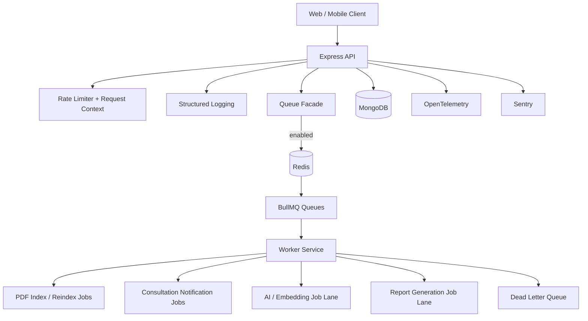

# nritax.ai Backend Scalability Rollout

## Executive Summary

The current production backend is a single **Express + MongoDB** service, not a PostgreSQL-first serverless platform. To avoid breaking live traffic, this rollout introduces **Redis + BullMQ workers beside the existing API**, with feature-flagged fallbacks so current synchronous behavior remains available during migration and rollback.

## Target Architecture

## Incremental Workloads Moved Off Hot Path

- PDF indexing and reindexing can now be queued.
- Consultation notification emails can now be processed by workers.
- AI, embedding, and report queues are scaffolded for phased migration.

## Queue Design

### Queues

- `pdf-jobs`
- `notification-jobs`
- `ai-jobs`
- `report-jobs`
- `dead-letter-jobs`

### Job Types

- `pdf.index-file`
- `pdf.reindex-all`
- `consultation.notifications`
- `ai.embedding`
- `ai.generation`
- `report.generation`

## Feature Flags

- `BACKGROUND_JOBS_ENABLED=false`
- `PDF_QUEUE_ENABLED=false`
- `CONSULTATION_QUEUE_ENABLED=false`
- `AI_QUEUE_ENABLED=false`
- `REPORT_QUEUE_ENABLED=false`
- `STRUCTURED_LOGGING_ENABLED=true`
- `OTEL_ENABLED=false`
- `SENTRY_ENABLED=false`

With all queue flags off, controllers keep using safe inline execution.

## Rollout Plan

1. Deploy API and worker code with all queue flags off.
2. Enable `BACKGROUND_JOBS_ENABLED=true` in staging with Redis.
3. Enable `CONSULTATION_QUEUE_ENABLED=true` first.
4. Enable `PDF_QUEUE_ENABLED=true` next for uploads and reindex jobs.
5. Observe `AsyncJob` audit records and BullMQ failed jobs.
6. Migrate AI/report workloads only after dedicated async APIs are introduced.

## Rollback Strategy

1. Turn off queue feature flags.
2. API controllers immediately fall back to inline execution.
3. Leave Redis and workers deployed but idle.
4. Existing API contracts and synchronous responses remain valid.

## Database Notes

The current repo uses **MongoDB**, so the implemented changes improve connection pooling and add indexes there. If nritax.ai later introduces PostgreSQL for analytics or enterprise reporting, recommended next steps are:

- Index subscription reconciliation tables by `user_id`, `provider`, `status`, and `created_at`
- Use PgBouncer or RDS Proxy for connection pooling
- Separate OLTP and analytical workloads
- Add Redis caching in front of read-heavy reporting paths

## Deployment Services

- `server/Dockerfile` for the API
- `server/Dockerfile.worker` for BullMQ workers
- `server/docker-compose.backend.yml` for local or staging bring-up with Redis
