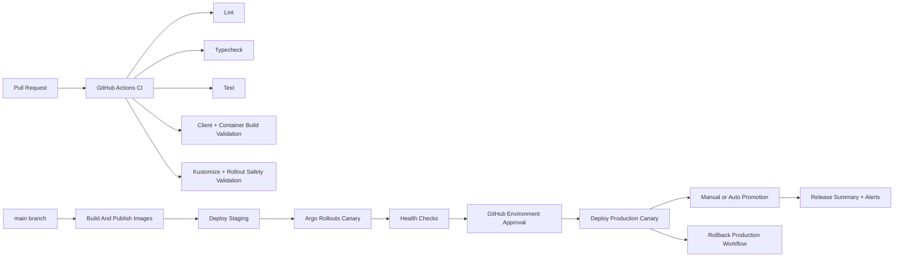

# nritax.ai CI/CD Architecture

## Goals

- Preserve the existing production deployment path.
- Add safer automation around testing, image publishing, staging promotion, production canaries, and rollback.
- Keep production changes approval-gated and behavior-first.

## Pipeline Architecture

## Workflows

### `ci.yml`

- Runs on pull requests and pushes to `main`.
- Installs root, client, and server dependencies.
- Runs:
  - `npm run lint`
  - `npm run typecheck`
  - `npm run test:server`
  - `npm --prefix client run build`
- Validates Kubernetes rollout safety and renders staging/production manifests.
- Builds API and worker container images without pushing them.

### `build-images.yml`

- Publishes versioned API and worker images.
- Supports manual builds with explicit image tags.
- Uses registry credentials from GitHub secrets.
- Keeps build and deploy concerns separated.

### `deploy-staging.yml`

- Manual promotion into the `staging` GitHub environment.
- Runs deployment preflight checks.
- Performs `kubectl apply --dry-run=server`.
- Applies manifests, updates API and worker images, waits for rollout readiness, promotes the staging canary, and verifies the staging health endpoint.

### `deploy-production.yml`

- Manual production deployment behind GitHub environment approvals.
- Starts an Argo Rollouts canary for the API first.
- Verifies production health before full promotion.
- Supports holding the canary for manual inspection by leaving `auto_promote=false`.
- Rolls worker images only after API promotion.
- Supports a migration safety acknowledgment for any future migration hook.

### `rollback-production.yml`

- Aborts active canaries and undoes to the previous stable revision by default.
- Optionally targets a specific Argo revision.
- Can roll workers back in the same workflow.
- Verifies health after rollback.

## Environment Separation

- GitHub Environments:
  - `staging`
  - `production`
- Expected environment-scoped variables:
  - `STAGING_HEALTHCHECK_URL`
  - `PRODUCTION_HEALTHCHECK_URL`
- Expected environment-scoped secrets:
  - `KUBE_CONFIG_STAGING`
  - `KUBE_CONFIG_PRODUCTION`
  - `REGISTRY`
  - `REGISTRY_USERNAME`
  - `REGISTRY_PASSWORD`
  - `IMAGE_REPOSITORY`
  - `WORKER_IMAGE_REPOSITORY`
  - `ALERT_WEBHOOK_URL` optional

Production should require reviewer approval through GitHub Environment protection rules.

## Secret Management

- Do not place runtime secrets in workflow YAML.
- Keep cluster credentials in GitHub Environment secrets, not repository-wide secrets when environment-specific.
- Keep application runtime secrets in Kubernetes Secrets or a managed secret store injected into the cluster.
- Rotate:
  - registry credentials
  - kubeconfig credentials
  - application API keys
- Prefer short-lived credentials where supported by your platform.

## Deployment Safety Controls

- CI validates:
  - linting
  - type checks
  - server tests
  - client build
  - API and worker image builds
  - rollout manifest rendering
- Preflight checks validate:
  - environment name
  - image tag presence
  - health endpoint configuration
  - production approval intent
  - migration safety acknowledgment
- Rollout safety checks validate:
  - `/readyz` and `/livez` probes remain present
  - API rollout still uses stable/canary services and pause steps

## Zero-Downtime Strategy

- API uses Argo Rollouts with stable/canary services.
- Existing readiness and liveness probes remain authoritative.
- Worker changes are separated from API canary progression.
- Production promotion can be paused before full cutover.
- Rollback is behavioral and image-based, not schema-destructive.

## Migration Safety

This repo does not currently include an automated schema migration framework. The workflow still includes a migration gate so future migration automation cannot run silently.

Rules:

- Default `run_migrations=false`
- If migrations are ever enabled, the workflow requires:
  - explicit operator intent
  - `migration_safety_ack=approved-no-destructive-migrations`
- No destructive rollback of schema assets should be automated in CI/CD.

## Monitoring And Release Tracking

- Health endpoints:
  - `/health`
  - `/ready`
  - `/readyz`
  - `/metrics`
- Existing Prometheus and Grafana assets continue to provide deployment telemetry.
- Each deploy workflow writes a GitHub step summary with:
  - environment
  - image tag
  - promotion status
  - migration intent
- Failures can post to `ALERT_WEBHOOK_URL`.

## Rollback Strategy

1. Abort in-flight canary if needed.
2. Undo API rollout to the previous stable revision or a specific Argo revision.
3. Roll back workers if the release touched background processing.
4. Verify `/health` after rollback.
5. Disable newly enabled feature flags if behavioral rollback is still needed.

## Low-Risk Rollout Order

1. Merge CI workflow changes and confirm they are green.
2. Configure GitHub Environments and secrets.
3. Run `build-images.yml` for a staging tag.
4. Deploy to staging and confirm health plus dashboard stability.
5. Start a production canary with `auto_promote=false`.
6. Observe metrics and logs.
7. Promote the canary only after validation.
