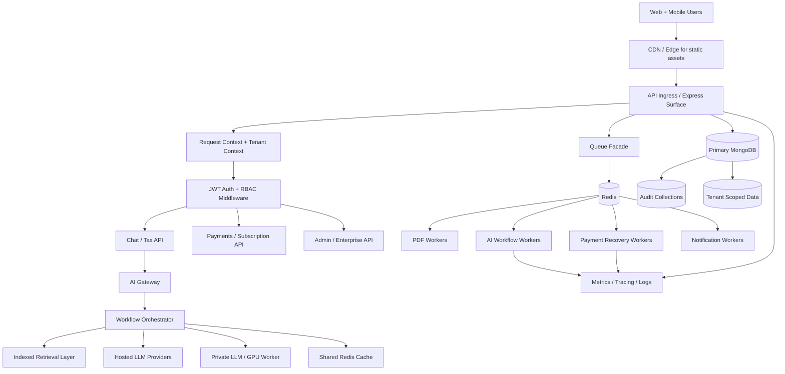
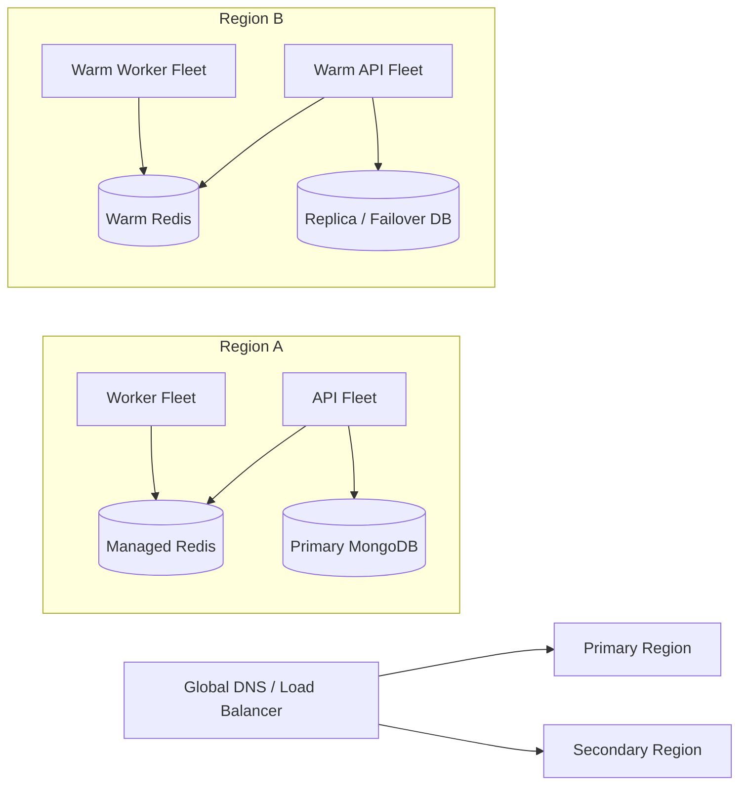
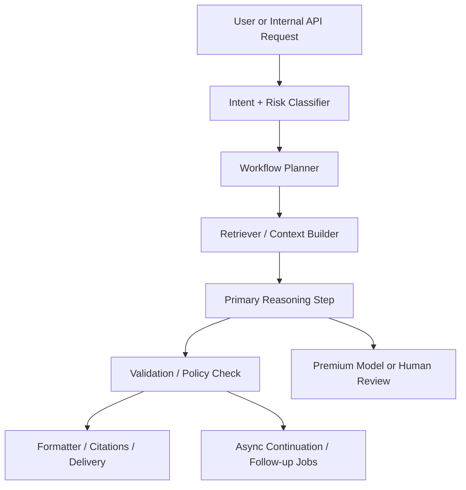

# nritax.ai Enterprise Architecture Roadmap

## Executive Summary

As of **May 14, 2026**, nritax.ai already has the right beginnings for enterprise scale:

- a stable Express API surface
- feature-flagged AI gateway routing
- Redis/BullMQ scaffolding for async execution
- worker deployments and HPAs
- request metrics, audit logging, and security instrumentation

The biggest remaining gap is not raw functionality. It is **platform hardening and separation of concerns**:

- tenant-aware access controls are not yet present
- worker autoscaling is CPU-based, not queue-SLO-based
- multi-region is planned but not yet operationalized
- reliability patterns are partially implemented but not consistently isolated per workload
- AI orchestration exists, but future multi-agent workflow chaining is not yet modeled as a first-class control plane

The low-risk path is to keep the current production surface intact and add enterprise capabilities as **additive layers** behind flags, headers, queue lanes, and deployment overlays.

## Current-State Assessment

### Strengths already in repo

- API and workers can scale independently.
- Queue and worker plumbing already exists for incremental cutover.
- Security audit logging exists and now supports tenant-aware enrichment.
- AI routing, cost telemetry, and observability are already feature-flagged.
- Readiness and liveness probes already support safer rollout patterns.

### Gaps to close next

- No tenant isolation contract yet for requests, data, or audit filtering.
- No admin RBAC enforcement layer on routes yet.
- No formal service-level objectives tied to autoscaling or failover.
- No disaster recovery runbook tied to exact RPO/RTO targets.
- No orchestration registry for chained AI workflows, agent handoffs, or compensating actions.

## Target Architecture Principles

1. Preserve existing production APIs.
2. Prefer additive control planes over rewrites.
3. Separate user-facing latency paths from background and AI-heavy paths.
4. Make tenant and access context explicit on every protected request.
5. Scale by workload class, not by one global fleet.
6. Start with single-region hardening, then multi-region active-passive, then selective active-active.

## Future-State Architecture

## Multi-Region Target State

Recommended progression:

1. Single-region hardened with queue isolation and SLO-based alerts.
2. Warm passive secondary region with rehearsed failover.
3. Regional traffic split only for stateless API paths after data consistency is proven.

## Enterprise Readiness Workstreams

### 1. Scalability readiness

#### High concurrency support

- Keep authenticated APIs stateless.
- Move PDF, embedding, report generation, and non-interactive AI chains off the request path.
- Introduce shared Redis cache for gateway response cache and retrieval cache when multiple API replicas are live.
- Add queue-level concurrency controls so bursty AI jobs do not starve payment or notification work.

#### Horizontal scaling

- Keep API HPA tied to request latency proxies and CPU.
- Split worker pools by job class:
  - general worker
  - AI worker
  - payment recovery worker
  - GPU worker
- Move from one worker HPA to per-lane HPAs as queue volume grows.

#### Worker autoscaling

Current worker autoscaling is CPU-based only. Enterprise target should be:

- scale on queue depth
- scale on queue wait p95
- protect max concurrency per queue
- apply separate budgets for payment and AI lanes

#### Multi-region readiness

- Standardize `APP_REGION` tagging everywhere.
- Keep region-local Redis and worker fleets.
- Define explicit failover ownership for Mongo, Redis, and secrets.
- Add backup restore drills and region failover drills before any live split routing.

### 2. Tenant isolation readiness

The safest near-term model is **logical tenant isolation** before physical separation:

- add tenant context to requests, logs, and audits
- add tenant fields to user and future business records
- enforce tenant filters in service and repository boundaries
- isolate enterprise analytics and admin views by tenant

Recommended future progression:

1. Shared database, tenant-scoped documents
2. Shared cluster, tenant-scoped indexes and encryption boundaries
3. Optional per-tenant data stores for regulated enterprise customers

### 3. Permission systems and RBAC

Additive scaffolding is now the right move:

- role definitions in platform code
- request-level permission context
- enforcement middleware behind `ENTERPRISE_RBAC_ENABLED`
- audit events for denied access

Suggested role baseline:

- `end_user`
- `support`
- `tax_expert`
- `finance`
- `admin`

Suggested next phase:

- route inventories mapped to required permissions
- admin-only analytics and audit APIs
- enterprise support impersonation with approval + audit trails

### 4. Reliability and failure isolation

#### Fault tolerance

- Keep hosted AI providers as fallback even after private LLM adoption.
- Use timeouts and validation per route tier.
- Keep queue cutovers reversible via flags.

#### Failure isolation

- isolate AI queues from payment queues
- isolate GPU workloads from default worker pools
- avoid letting background job saturation block API readiness

#### Graceful degradation

- preserve synchronous fallback for queued workloads until proven
- return cached or safe fallback chat responses during provider outages
- degrade non-critical analytics before degrading core tax guidance or payment workflows

#### Disaster recovery readiness

Define explicit enterprise targets:

- API RTO: 30 minutes
- queue and worker RTO: 60 minutes
- payment reconciliation RPO: 5 minutes
- audit log RPO: 15 minutes

These should be validated with documented drills, not only backups.

### 5. Future AI workflow readiness

The current AI gateway is a strong start, but enterprise AI workflows need a durable orchestration layer.

Future-state pattern:

Prepare for:

- workflow definitions with stable IDs
- step-level retries and deadlines
- provider and tool execution traces
- compensating actions for partially completed chains
- queue-backed async continuation for long-running tax workflows

## Scalability Benchmarks

These should be used as platform gates before enterprise customer launch.

### API benchmarks

- sustained authenticated API concurrency: 300-500 concurrent sessions
- chat request p95 under normal load: less than 4s
- non-AI API p95: less than 800ms
- error rate during canary: under 1%

### Worker benchmarks

- consultation notification queue wait p95: less than 30s
- payment recovery queue wait p95: less than 60s
- PDF indexing queue wait p95: less than 5m
- AI async workflow queue wait p95: less than 90s

### Data and cache benchmarks

- Redis failover rehearsal completed
- Mongo restore rehearsal completed
- cache hit rate on AI response or retrieval paths: more than 20% on repeat-heavy workloads

## Capacity Planning Strategy

### Baseline capacity model

Plan capacity by workload family, not only total QPS:

- user chat traffic
- admin/reporting traffic
- payment verification traffic
- background document processing
- AI orchestration and embedding traffic

### Initial planning inputs

- peak concurrent chat sessions
- average and p95 prompt token volumes
- queue arrivals per minute by job class
- average job duration and retry rates
- regional traffic distribution
- enterprise tenant onboarding forecasts

### Recommended planning loops

1. Weekly queue and API trend review
2. Monthly cost, latency, and cache review
3. Quarterly failover and restore rehearsal
4. Pre-launch capacity review before each enterprise or region launch

## Incremental Roadmap

### Phase 0: Enterprise scaffolding

- tenant context in requests and audits
- role and permission scaffolding
- route inventory for future RBAC
- enterprise architecture scorecard

### Phase 1: Scale-safe operations

- queue-SLO dashboards
- per-lane worker concurrency controls
- Redis-backed shared caches
- autoscaling policy refinement

### Phase 2: Reliability hardening

- disaster recovery playbooks
- restore drills
- active-passive regional warm standby
- workload isolation by queue and deployment class

### Phase 3: Enterprise control plane

- admin RBAC enforcement
- tenant-scoped analytics
- enterprise audit APIs
- support tooling with approval trails

### Phase 4: Future AI workflow platform

- workflow registry
- async workflow chaining
- step-level orchestration telemetry
- model/policy/validator separation

## Low-Risk Rollout Plan

1. Deploy tenant and RBAC scaffolding with enforcement off.
2. Emit tenant-aware audit logs before blocking any request.
3. Add admin-only permissions to new routes first, not existing end-user routes.
4. Convert worker scaling to queue-aware policies in staging before production.
5. Rehearse regional failover before any enterprise SLA commitment.

## Concrete Next Steps

1. Turn the new tenant and RBAC scaffolding into an internal route inventory and permission matrix.
2. Add queue-aware autoscaling metrics for workers and align alerts to queue wait p95.
3. Introduce a shared Redis cache tier for multi-instance AI and retrieval caching.
4. Write disaster recovery runbooks with explicit RTO/RPO targets and drill owners.
5. Create a workflow registry for future multi-agent and chained AI execution.
