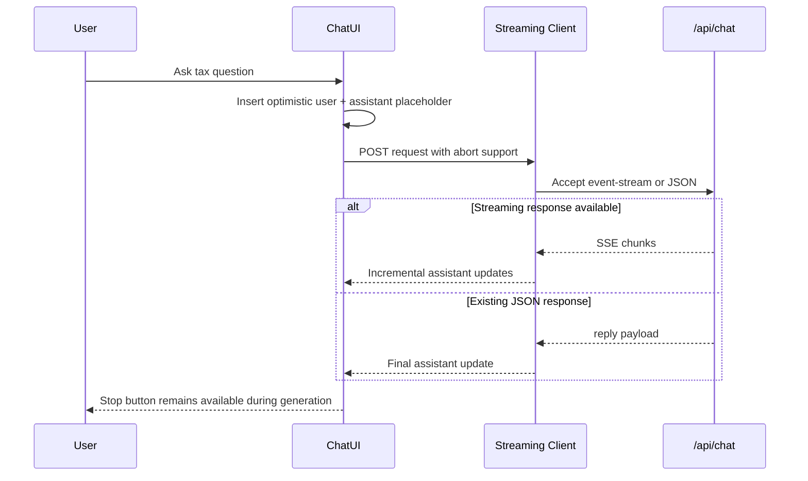

# nritax.ai Frontend Performance Rollout

## Optimized Frontend Architecture

```mermaid
flowchart TD
    Browser[Browser or Native WebView] --> Router[React Router Shell]
    Router --> Suspense[Route Suspense Boundary]
    Suspense --> LazyPages[Lazy Route Modules]
    Router --> IdleWarmup[Idle Route Preload]
    LazyPages --> Chat[AI Chat Route]
    LazyPages --> Dashboard[Dashboard Route]
    LazyPages --> Pricing[Pricing and Checkout]
    Chat --> StreamClient[Streaming-capable Chat Client]
    StreamClient --> Api[/api/chat]
    Router --> Perf[Performance Monitoring]
    Perf --> Analytics[Analytics Endpoint]
    Build[Vite Build] --> Chunking[Manual Vendor Chunking]
    Chunking --> BundleStats[bundle-stats.json]
    BundleStats --> Report[frontend-bundle-report-2026-05.md]
```

## What Changed

- Expanded route-based code splitting so chat, home, hero, pricing, policy, dashboard, compliance, Android Yukti, and the floating Yukti widget no longer ride in the primary shell bundle.
- Added route-aware skeleton fallbacks to preserve perceived speed during lazy route transitions without changing URLs or navigation contracts.
- Added idle preloading for likely next routes after home, pricing, chat, and authenticated sessions.
- Upgraded the main chat page to support streaming responses when available, with graceful fallback to the existing JSON response format.
- Added frontend performance instrumentation for route render time, paint metrics, layout shift, and long tasks.
- Added build-time bundle stats emission and a report generator for rollout validation.

## AI Interaction Flow



## Rollout Plan

1. Deploy the lazy-route, skeleton, and performance monitoring changes as-is. They are backward compatible and do not require backend coordination.
2. Validate `frontend_route_render` and `frontend_performance_metric` analytics in staging.
3. Run `npm --prefix client run build:report` in CI to emit bundle stats and the markdown bundle report.
4. If backend SSE is enabled later, the chat UI will begin streaming automatically without another frontend migration.

## Rollback Plan

1. Revert the frontend commit or disable the new lazy modules by restoring direct imports in `App.tsx`.
2. Keep performance monitoring in place if desired because it is read-only and does not affect user flows.
3. If streaming behavior needs to be disabled, the chat client already falls back to plain JSON responses automatically.

## UI Improvement Recommendations

- Replace the static dashboard demo cards with cached live summaries so the dashboard skeleton can hand off to real data instead of placeholder content.
- Consolidate `AIChat.tsx` and `Chat.tsx` onto one shared chat client to remove duplicate request logic and reduce maintenance cost.
- Audit the remaining dual animation stack and remove `framer-motion` from dependencies once the package lock is regenerated in a dependency refresh PR.
- Run a dependency cleanup pass for unused libraries in a separate low-risk change so the lockfile can be updated cleanly.
