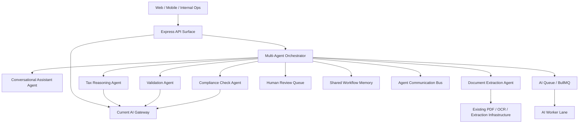
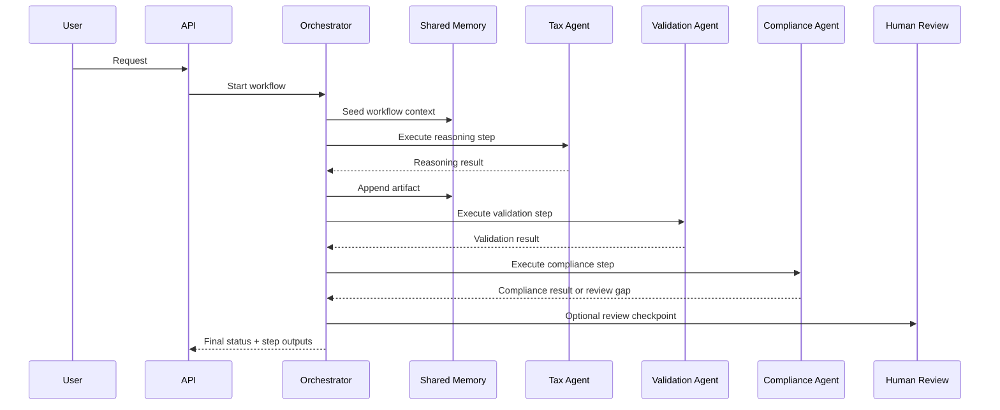

# nritax.ai Multi-Agent Architecture

## Goals

- Prepare a future multi-agent platform without changing current production chat behavior.
- Keep `/api/chat` and current AI gateway flows stable.
- Introduce orchestration as an additive control plane behind feature flags and async worker lanes.

## Design Principles

- Backward compatibility first
- Orchestration behind `MULTI_AGENT_ORCHESTRATION_ENABLED=false` by default
- Reuse existing AI queue and worker infrastructure
- Treat multi-agent workflows as opt-in workflow definitions, not a replacement for current chat routing
- Keep failure isolation between orchestration control, synchronous chat, and async background work

## Target Agent Topology

## Agent Responsibilities

- `workflow-orchestrator`
  - plans workflows
  - coordinates retries, deadlines, and chaining
- `conversational-assistant`
  - handles user-facing intake and output shaping
- `tax-reasoning`
  - produces substantive tax reasoning
- `document-extraction`
  - extracts structured fields from uploads and staged documents
- `validation`
  - cross-checks evidence, completeness, and consistency
- `compliance-check`
  - checks policy, forms, treaty prerequisites, and evidence gaps
- `human-review`
  - escalates cases that require manual confirmation

## Orchestration Layer

Scaffolded modules:

- `server/services/multiAgent/agentRegistry.js`
- `server/services/multiAgent/workflowCatalog.js`
- `server/services/multiAgent/taskRouter.js`
- `server/services/multiAgent/agentRuntime.js`
- `server/services/multiAgent/orchestrator.js`
- `server/services/multiAgent/memoryStore.js`
- `server/services/multiAgent/communicationBus.js`
- `server/services/multiAgent/humanReview.js`

## Shared Memory And Context

The shared memory layer is designed to keep:

- workflow-level context
- accumulated step outputs
- artifacts and evidence references
- agent messages

Current implementation is an in-process scaffold so it does not affect production storage patterns.

Future upgrade path:

1. In-memory scaffold
2. Redis-backed shared workflow memory
3. Durable Mongo audit/history model

## Workflow Definitions

Initial workflow registry:

- `tax-advice.v1`
- `document-review.v1`
- `compliance-review.v1`

These are workflow definitions only. They do not intercept current production chat flows unless explicitly enabled.

## Agent Communication Framework

## Reliability Controls

- Per-step timeout controls
- Retry limits per workflow step
- Optional-step support
- Human-review checkpoint generation
- Async execution mode support through the existing `ai-jobs` queue
- Control plane stays inert when feature flags are off

## Failure Recovery Model

- Step timeout returns `timed_out`
- Failed optional steps do not abort the entire workflow
- Required step failures stop workflow progression
- Human review checkpoints are emitted instead of forcing unsafe auto-completion
- Dead-letter handling can reuse the existing worker DLQ path for async workflows

## Incremental Adoption Plan

### Phase 0

- Keep `MULTI_AGENT_ORCHESTRATION_ENABLED=false`
- Deploy scaffold only
- Validate tests, metrics, and no production route behavior changes

### Phase 1

- Use orchestration for internal or staging-only document/compliance workflows
- Keep `/api/chat` on the current AI gateway path

### Phase 2

- Enable `MULTI_AGENT_ASYNC_ENABLED=true` for selected async workflows
- Route document-review or compliance-review background jobs to `ai.workflow`

### Phase 3

- Add durable Redis workflow memory
- Add Mongo-backed workflow audit/history
- Add human-review queue and operator UI hooks

### Phase 4

- Let selected `/api/chat` scenarios call the orchestrator as a hidden control-plane layer while preserving the current response contract

## Backward Compatibility

- New feature flags default to `false`
- Existing AI gateway logic remains the primary production path
- Existing worker queue names remain unchanged
- `ai.workflow` is additive inside the existing `ai-jobs` lane
- Current synchronous and queue-backed flows continue to function as before
