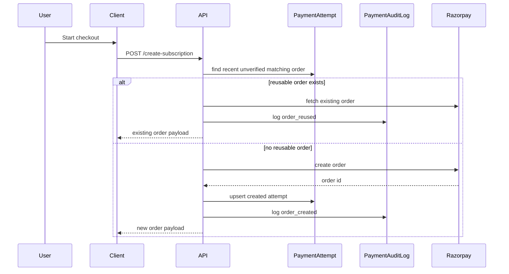
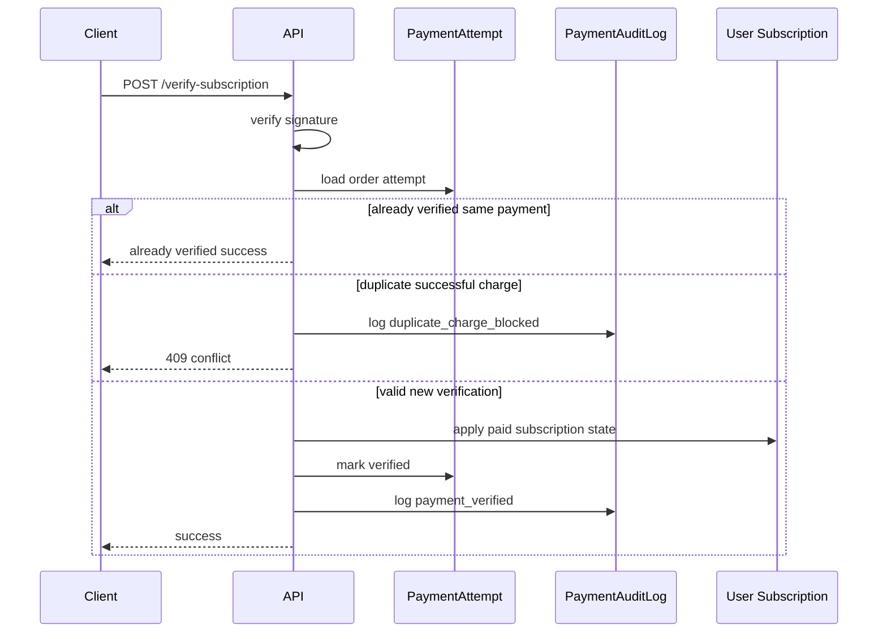
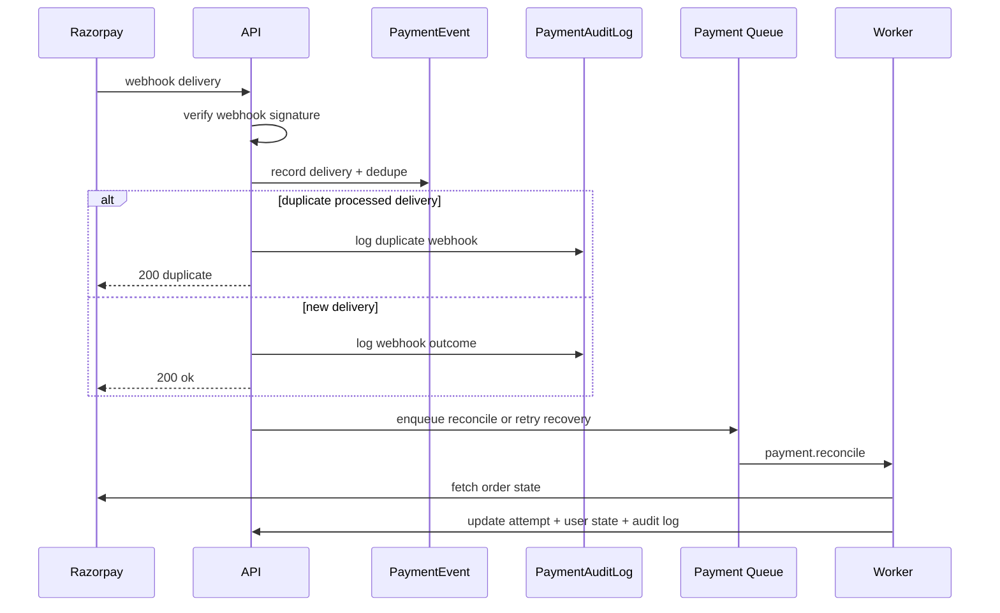

# nritax.ai Payment Reliability Rollout

## Reliable Payment Architecture

```mermaid
flowchart TD
    Client[Checkout Client] --> API[/api/subscription/create-subscription]
    API --> Attempt[(PaymentAttempt)]
    API --> Audit[(PaymentAuditLog)]
    API --> RP[Razorpay Orders API]
    Client --> Verify[/api/subscription/verify-subscription]
    Verify --> State[Payment State Machine]
    State --> User[(User Subscription)]
    RazorWebhook[Razorpay Webhook] --> Webhook[/api/subscription/razorpay-webhook]
    Webhook --> Event[(PaymentEvent)]
    Webhook --> Audit
    API --> Reconcile[/api/subscription/reconcile]
    Reconcile --> Queue[Payment Reconcile Job]
    Queue --> Worker[Worker Runtime]
    Worker --> RP
    Worker --> Attempt
    Worker --> Audit
    Worker --> User
```

## Checkout Sequence



## Verification Sequence



## Webhook + Recovery Sequence



## What This Adds

- Idempotent order reuse for recent unverified checkouts
- Duplicate successful charge blocking at verification time
- Transaction audit logs via `PaymentAuditLog`
- Recovery metadata and retry scheduling fields on `PaymentAttempt`
- Payment reconciliation endpoint and queued recovery workflow
- Reliability summary endpoint for failures, delayed webhooks, and mismatches

## Backward Compatibility

- Existing checkout, verify, and webhook endpoints remain functional
- New endpoints are additive:
  - `GET /api/subscription/reliability-status`
  - `POST /api/subscription/reconcile`
  - `POST /api/subscription/retry-recoveries`
- All changes remain guarded by feature flags where operationally significant

## Rollout Plan

1. Deploy with `PAYMENT_RELIABILITY_ENABLED=true`, `PAYMENT_RECONCILIATION_ENABLED=true`, `PAYMENT_QUEUE_ENABLED=false`
2. Observe `reliability-status` and audit log volume
3. Turn on `BACKGROUND_JOBS_ENABLED=true` and `PAYMENT_QUEUE_ENABLED=true` in staging
4. Enable scheduled `/retry-recoveries` invocation after worker health is stable
5. Add alerting on delayed webhooks and duplicate-charge blocks

## Rollback Plan

1. Turn off `PAYMENT_QUEUE_ENABLED`
2. If necessary, turn off `PAYMENT_RECONCILIATION_ENABLED`
3. Leave `PAYMENT_RELIABILITY_ENABLED` on if audit-only mode is still desired
4. Existing checkout and verify routes keep functioning without the queue path
