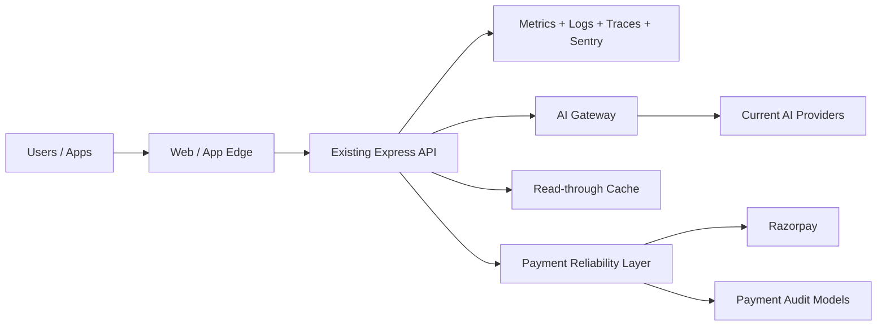
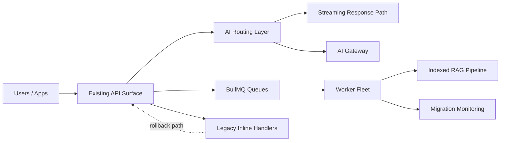
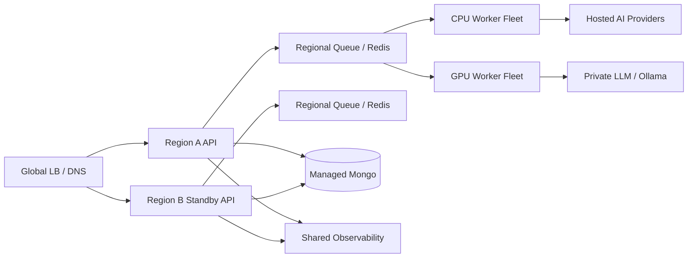
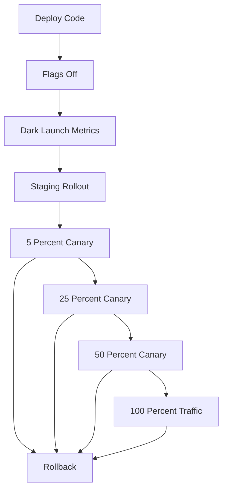

# nritax.ai Rollout Architecture Diagrams

## Phase 1 rollout architecture

```mermaid
flowchart LR
    U[Users / Apps] --> CDN[Web / App Edge]
    CDN --> API[Existing Express API]
    API --> OBS[Metrics + Logs + Traces + Sentry]
    API --> AIGW[AI Gateway]
    AIGW --> LEGACYAI[Current AI Providers]
    API --> CACHE[Read-through Cache]
    API --> PAY[Payment Reliability Layer]
    PAY --> RZ[Razorpay]
    PAY --> AUDIT[Payment Audit Models]
```

## Phase 2 rollout architecture

```mermaid
flowchart LR
    U[Users / Apps] --> API[Existing API Surface]
    API --> ROUTER[AI Routing Layer]
    ROUTER --> STREAM[Streaming Response Path]
    ROUTER --> AIGW[AI Gateway]
    API --> Q[BullMQ Queues]
    Q --> W[Worker Fleet]
    W --> RAGIDX[Indexed RAG Pipeline]
    API --> INLINE[Legacy Inline Handlers]
    INLINE -. rollback path .-> API
    W --> OBS[Migration Monitoring]
```

## Phase 3 rollout architecture

```mermaid
flowchart LR
    GSLB[Global LB / DNS] --> API1[Region A API]
    GSLB --> API2[Region B Standby API]
    API1 --> Q1[Regional Queue / Redis]
    API2 --> Q2[Regional Queue / Redis]
    Q1 --> W1[CPU Worker Fleet]
    Q1 --> GPU1[GPU Worker Fleet]
    W1 --> LLMEXT[Hosted AI Providers]
    GPU1 --> PRIVLLM[Private LLM / Ollama]
    API1 --> MONGO[(Managed Mongo)]
    API2 --> MONGO
    API1 --> OBS[Shared Observability]
    API2 --> OBS
```

## Safe traffic-control model

```mermaid
flowchart TD
    D[Deploy Code] --> F0[Flags Off]
    F0 --> DL[Dark Launch Metrics]
    DL --> STG[Staging Rollout]
    STG --> C5[5 Percent Canary]
    C5 --> C25[25 Percent Canary]
    C25 --> C50[50 Percent Canary]
    C50 --> C100[100 Percent Traffic]
    C5 --> RB[Rollback]
    C25 --> RB
    C50 --> RB
    C100 --> RB
```
